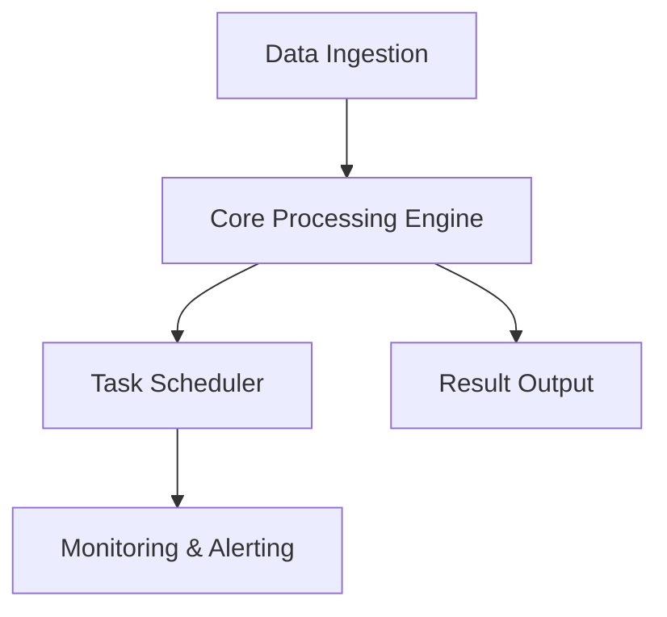

# 7-Dimensions Deep-Dive Framework

> All position papers must be filled out according to these 7 dimensions (none may be omitted). Dimension 6, "Fatal Flaw Disclosure," is the core anti-bias design.

---

## Dimension Overview

| # | Dimension | Content | Required |
|---|-----------|---------|:--------:|
| 1 | Architecture Overview | Mermaid diagram + main directory structure | ★ |
| 2 | Core Capability List | What the project actually does (enumerated by feature) | ★ |
| 3 | Data Model | Key classes / tables / interfaces | ★ |
| 4 | Extension Points | Design-level hooks / plugin slots / configuration entry points | ★ |
| 5 | Transformation Cost Estimate | How much code needs to change after forking to build the target product | ★ |
| 6 | ⭐ **Fatal Flaw Disclosure** | The project's 3 biggest flaws | ★★ |
| 7 | Integration Feasibility with Other Candidates | vs Other_1 / Other_2 | ★ |

---

## Dimension 1: Architecture Overview

**Purpose**: Let the Lead Judge understand the skeleton of this project in 5 minutes.

**Required content**:
- Mermaid architecture diagram (no more than 15 nodes)
- Main directory structure (tree, depth ≤ 3 levels)
- One-sentence positioning for each core module

**Example**:
```markdown
### 1. Architecture Overview



Main directory structure:
- `adapters/` Data source adapter layer
- `core/` Core business logic
- `scheduler/` Task scheduling module
- `outputs/` Result output/push layer
```

**Anti-patterns**: Pasting a 50-line directory tree; Mermaid diagram exceeding 30 nodes.

---

## Dimension 2: Core Capability List

**Purpose**: Let the Judge know "what this project actually does" — not what the README boasts, but what is actually in the code.

**Required content**:
- Enumerated by feature (5-10 items)
- Each item labeled with "maturity": Stable / Beta / Experimental

**Example**:
```markdown
### 2. Core Capability List

- ✅ Stable: Core task processing (supports both synchronous and asynchronous modes)
- ✅ Stable: 10+ built-in task scheduling strategies (scheduled, triggered, delayed, etc.)
- 🟡 Beta: Distributed task coordination (only supports single broker node)
- 🟡 Beta: Real-time task status tracking (Web UI is incomplete)
- 🔬 Experimental: LLM-enhanced decision making (rough integration, not production-ready)
- ❌ Not implemented: Cross-language task dispatch
- ❌ Not implemented: Task dependency graph (DAG) visualization
```

**Anti-patterns**: Copying the README's features list verbatim (README typically overstates); not providing maturity levels.

---

## Dimension 3: Data Model

**Purpose**: Let the Judge assess "whether the data layer can be unified" — a critical bottleneck in multi-project composite scenarios.

**Required content**:
- Key classes / tables / interfaces (5-10)
- Field-level detail (for database tables)
- Serialization format (JSON / Protobuf / custom)

**Example**:
```markdown
### 3. Data Model

Core classes:
- `Task`: Task unit (id, name, payload, status, priority, created_at)
- `Worker`: Executor (id, capacity, queue_name, heartbeat_ts)
- `Queue`: Task queue (name, backend_type, max_size, retry_policy)
- `Result`: Task result (task_id, output, error, duration_ms)

Database tables (Redis / SQLite):
- `task_queue`: Pending tasks
- `task_results`: Historical result storage

Serialization: JSON (✅ cross-language friendly) / some modules use Pickle (⚠️ not cross-language)
```

**Anti-patterns**: Only writing class names without fields; not identifying schema risks.

---

## Dimension 4: Extension Points

**Purpose**: Let the Judge assess "how easy is it to add my own features."

**Required content**:
- Extension mechanisms designed into the architecture (inheritance from base class / plugins / configuration entry points)
- Difficulty assessment for actual modifications
- Hidden "anti-extension points" (places advertised as extensible but actually hardcoded)

**Example**:
```markdown
### 4. Extension Points

✅ Good extension:
- Data source: Inherit `BaseDataAdapter` to connect any data source
- Task type: Inherit `BaseTask` to define custom task logic

⚠️ Hard to extend:
- Scheduling strategy: Hardcoded in `Scheduler.run_loop()`, modifying requires touching core code
- Serialization layer: Defaults to Pickle; switching to JSON requires modifying multiple serialization call sites

❌ Anti-extension points:
- Config file path is hardcoded with no environment variable override mechanism
- Logging system is hardwired to print(), no logger injection interface
```

**Anti-patterns**: Only praising "highly extensible" without identifying anti-extension points.

---

## Dimension 5: Transformation Cost Estimate

**Purpose**: Give the Judge **quantifiable** decision-making data.

**Required content**:
- List of modules requiring transformation
- Estimated person-days (range, e.g., 5-8 person-days)
- Risk points (which transformations could blow up)

**Example**:
```markdown
### 5. Transformation Cost Estimate

Forking this project to transform it into the target product requires:

| Transformation Item | Estimated Person-Days | Risk |
|---------------------|:--------------------:|------|
| Connect target data source (replace existing adapter) | 2-3 | Low (has extension base class) |
| Transform core business logic module | 5-8 | ⚠️ High (hardcoded logic) |
| Connect notification/push channel | 1-2 | Low |
| Replace frontend framework | 8-12 | ⚠️ Medium (requires rewrite) |
| Integrate AI/LLM features | 3-5 | Medium (requires designing prompt flow) |

**Total estimate: 19-30 person-days**

**Main risk**: Core business logic module transformation may be more costly than estimated — hardcoded logic has wide scope of impact. If development encounters obstacles, an additional +10 person-days may be needed.
```

**Anti-patterns**: Estimating "3 months" without breakdown; not listing risks.

---

## Dimension 6: ⭐ Fatal Flaw Disclosure (Mandatory)

**Purpose**: **Core anti-bias design**. Forces paper authors to self-report the project's biggest problems.

**Why self-reporting is required**:
- The Red Team and other Advocates will eventually uncover these anyway
- Self-reporting is always better than being exposed by the opposition — at least you control the narrative
- Failure to report will be seen by the Lead Judge as "negligence / dishonesty," discounting the credibility of the entire paper

**Required format**: List 3 flaws, each with evidence.

**Example**:
```markdown
### 6. ⭐ Fatal Flaw Disclosure (Mandatory)

I (Advocate A) must honestly disclose the 3 biggest flaws of project {PROJECT_NAME}:

**Flaw 1**: Last commit was 2025-08 (six months ago); low community activity
- Evidence: GitHub commits page / Average issue response time: 14 days
- Impact: Bug fixes mainly require self-forking; cannot rely on upstream

**Flaw 2**: Core engine has hardcoded specific business logic that cannot be replaced via configuration
- Evidence: `engine/core.py` lines 142-180 (hardcoded branching logic)
- Impact: If the product requires different processing strategies, the core module must be rewritten

**Flaw 3**: Test coverage at 18% (measured)
- Evidence: `coverage` tool output
- Impact: High regression risk during post-fork transformation; tests need to be written first
```

**Anti-patterns**:
- Missing this section → paper is immediately considered negligent
- Writing "No significant flaws found at this time" → equivalent to not reporting
- Only reporting trivial issues ("documentation is incomplete in English") → Lead Judge will see through it

---

## Dimension 7: Integration Feasibility with Other Candidate Projects

**Purpose**: Assess "if not forking alone, can it be combined with others."

**Required content**:
- Evaluate each other candidate project (Other_1 / Other_2 / ...) individually
- Three-tier conclusion: Can work together / Mutually exclusive / Partial integration
- Brief rationale (≤ 100 words per item)

**Example**:
```markdown
### 7. Integration Feasibility with Other Candidate Projects

- **vs Project-Beta (Other_1)**:
  - Conclusion: **Mutually exclusive**
  - Rationale: The two use different underlying frameworks (desktop vs web); the frontend layer is completely incompatible; data model field definitions are also different

- **vs Project-Gamma (Other_2)**:
  - Conclusion: **Partial integration**
  - Rationale: Project-Gamma's notification push module is designed as an independent plugin and can be extracted and reused directly; other modules use different tech stacks and are mutually exclusive

- **vs Project-Delta (Other_3)**:
  - Conclusion: **Can work together**
  - Rationale: Both are based on the same data processing library; data models can be unified through an adapter layer; Project-Delta's core engine can replace the hardcoded version in this project
```

**Anti-patterns**: Marking all projects as "mutually exclusive" (indicates no serious evaluation); not providing rationale.

---

## Complete Paper Skeleton

Combining 7 dimensions into a complete position paper:

```markdown
# Position Paper: {PROJECT_NAME}
Advocate: {Teammate Name}
Project: {PROJECT_NAME} ({GitHub URL})
Target Product: {PROJECT_DEFINITION}

## 1. Architecture Overview
...

## 2. Core Capability List
...

## 3. Data Model
...

## 4. Extension Points
...

## 5. Transformation Cost Estimate
...

## 6. ⭐ Fatal Flaw Disclosure (Mandatory)
...

## 7. Integration Feasibility with Other Candidate Projects
...

## Summary: Why Forking This Project Is the Optimal Choice
(Comprehensive argument based on the 7 dimensions above, ≤ 500 words)
```

---

## How the Lead Judge Uses the 7 Dimensions to Decide

In Phase 3 during the final verdict, Lead reviews the 7 dimensions in the following order:

1. **Dimension 5 (Transformation Cost)** + **Dimension 6 (Fatal Flaws)** → Elimination threshold (excessively high cost or fatal flaws disqualify directly)
2. **Dimension 2 (Core Capabilities)** + **Dimension 4 (Extension Points)** → Fit score
3. **Dimension 7 (Integration Feasibility)** → Determines whether to pursue multi-project composite
4. **Dimension 1 + 3 (Architecture + Data Model)** → Engineering evidence to validate the above conclusions

Lead is **prohibited** from making a decision based solely on Dimension 5 (cost) — all 7 dimensions must be synthesized.

---

## Dimension Adjustments for Other Scenarios (Non-Fork Selection)

The 7-dimensions framework defaults to "open-source project fork selection." Other scenarios require adaptation:

| Scenario | How to Adjust Dimensions 1-7 |
|----------|------------------------------|
| SaaS selection (e.g., Vercel vs Netlify) | Dimension 1 → "product feature map"; Dimension 3 → "API/data export"; Dimension 5 → "migration cost"; others remain similar |
| Library selection (e.g., LangChain vs LlamaIndex) | Dimension 4 → "plugin ecosystem"; Dimension 5 → "learning curve + integration cost"; Dimension 7 evaluates "interoperability with other libraries" |
| Tech stack selection (React vs Vue) | Dimension 2 → "ecosystem scale"; Dimension 4 → "toolchain richness"; Dimension 5 → "hiring difficulty"; Dimension 7 → "coexistence possibility with existing tech stack" |
| Architecture pattern selection (Monolith vs Microservices) | Dimension 1 → "system topology diagram"; Dimension 3 → "communication protocol"; Dimension 5 → "operational complexity" |

Specific adjustments are decided by Lead in Phase 0 based on the scenario type, and are documented in `00-task-assignment.md` explaining the specific meaning of each of the 7 dimensions for this run.
